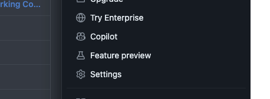
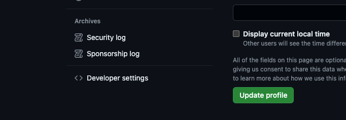
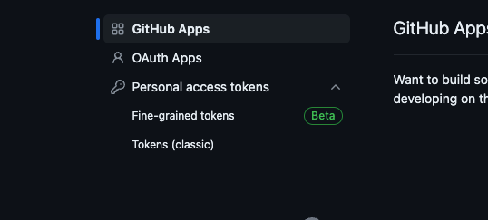
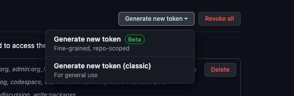
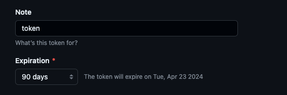
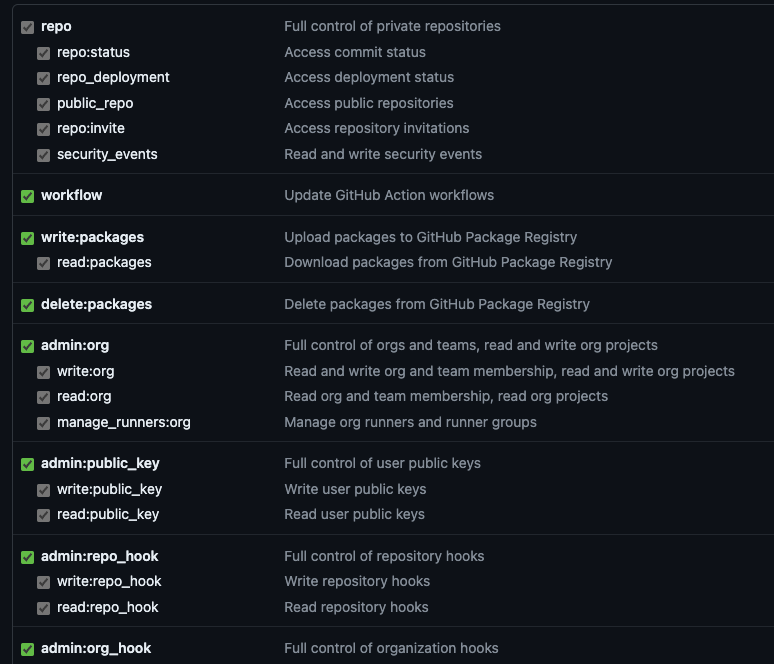
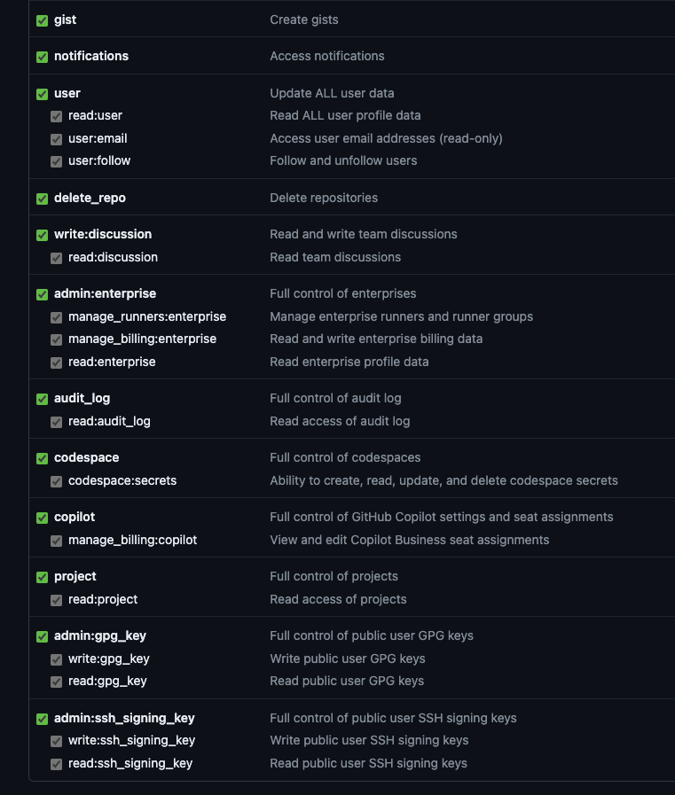

- acceder a configuracion desde el menu derecho
	- 
- acceder a opciones de desarrollador o developer settings
	- 
- personal access token
	- 
- generar nuevo token clasico
	- 
- agregar un nombre y definir la expiracion del token
	- 
- marcar todos los checks
	- {:height 651, :width 749}
	- 
- guardar el token de forma segura, este nos dara acceso a github y repositorios via git
-